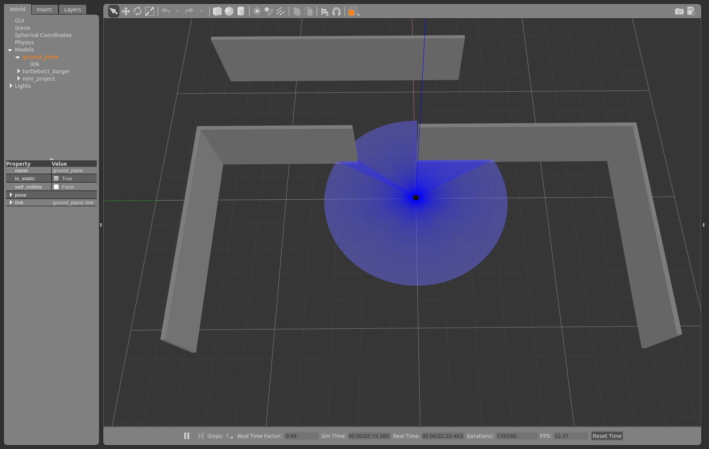

# ROS_LaserScan_project
Directing a turtlebot using Laser scan reading in a defined obstacle environment.

Launch the turtlebot3_gazebo package: **roslaunch turtlebot3_gazebo turtlebot3_empty_world.launch**

Spawn the gazebo model: **rosrun gazebo_ros spawn_model -file ~/catkin_ws/src/ROS_Laserscan_Project-main/world_model/model.sdf -sdf -model mini_project**

The turtlebot is given a defined environment, where it has to make a way through the obstacle infront.

The turtlebot has a built-in laser sensor that will give the distances to the nearest obstacles surrounding it

**Task:** 

Turtlebot has to find the opening in the door and has to drive towards the wall, make a turn and drive along it without colliding.

Then when free space is seen on left or right side (depending on the rotation direction that you chose earlier) turn again about ~90° and move further into the x direction into infinity. 

**outcomes:**

To brush up ROS basics, 

To manipulate LaserScan message from /scan topic.

Language used is python. 
